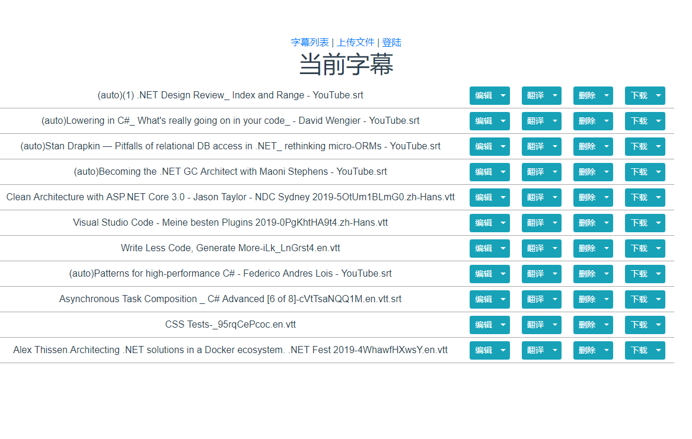
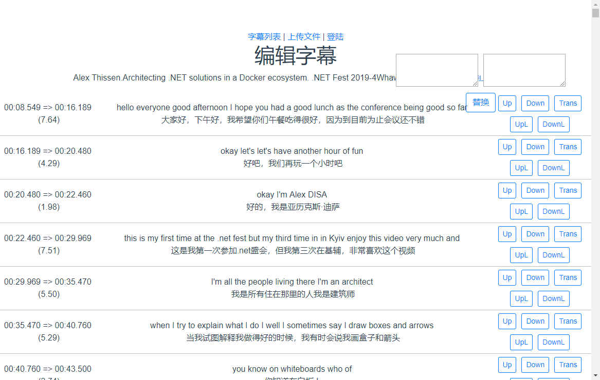

# bilibili工具包

## Youtube字幕(vtt,srt)合并与翻译工具--dmhb

因为youbute的自动字幕，是按照显示的内容来分段的，因为内容过段，并且一些有意义的片段会拆分到2个段落里，这样会导致机器翻译的结果及其的不准确。
为此，这个工具的第一版实现了上传字幕后，通过上下调整单词的顺序，实现了段落上的意义完整。
当时解析的是 srt 格式的字幕文件，在某段时间后发现之前的下载字幕的chrome插件无法用了，在研究 [youtube-dl](https://github.com/ytdl-org/youtube-dl)后，发现它支持字幕的下载：
` youtube-dl --sub-lang en --write-auto-sub  https://www.youtube.com/watch?v=... `

不过下载下来的是 .vtt 格式的文件。该文件虽然解析复杂了一些，但比原先的srt文件包含更多的内容（每个单词有自己的时间）。
有了这些时间，我将工具做了一下升级，写了一个[VTTRebuild](https://github.com/dogvane/bilibiliTools/tree/master/VVTRebuild)，用于重建字幕的时间轴信息。
虽然采用极为传统的方法，但也大大节省了对字幕调整的时间。

[在线测试地址](http://bilibilitools.csharptools.cn/dmhb)

软件截图

## b站字幕（弹幕）上传（发射）工具
.net core 改写了，主要是将上面一个工具生成的字幕发到b站的视频里（当时制作的时候B站还不支持上传文字类型的字幕，现在支持上传了，就没必要用这个了。）

## 离线视频重命名
这个是将手机下载的离线视频进行合并的小工具，需要使用ffmpeg进行合并

## VTTToBcc
将 vtt 格式的字幕文件转为 B站格式 的文件

## VTTtoSrt
将 vtt 格式的字幕文件转为 srt格式 的文件